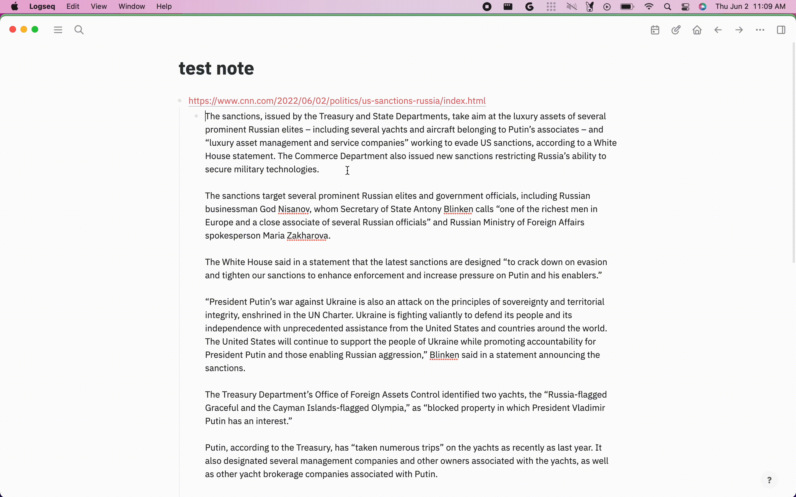

# Logseq Summarizer

Uses [sumy](https://pypi.org/project/sumy/) to summarize long text in logseq

## Alpha

Super WIP!!! May not work

## Installation

- Download a released version assets from Github.
- Unzip it.
- Click Load unpacked plugin, and select destination directory to the unzipped folder.

## Development

1. yarn
2. yarn build
3. Load the unpacked plugin from `dist`

## Pyodide

Minimal version created following these steps

1. Place full release in `public/pyodide`
2. Build plugin
3. Run the summarization function in logseq
4. Delete everything that is not the latest access time. Find by `ls -ltu`
5. Repeat 2 and 3
6. Restore files until it works

## Icon

[Data compression icons created by Eucalyp - Flaticon](https://www.flaticon.com/free-icons/data-compression)
