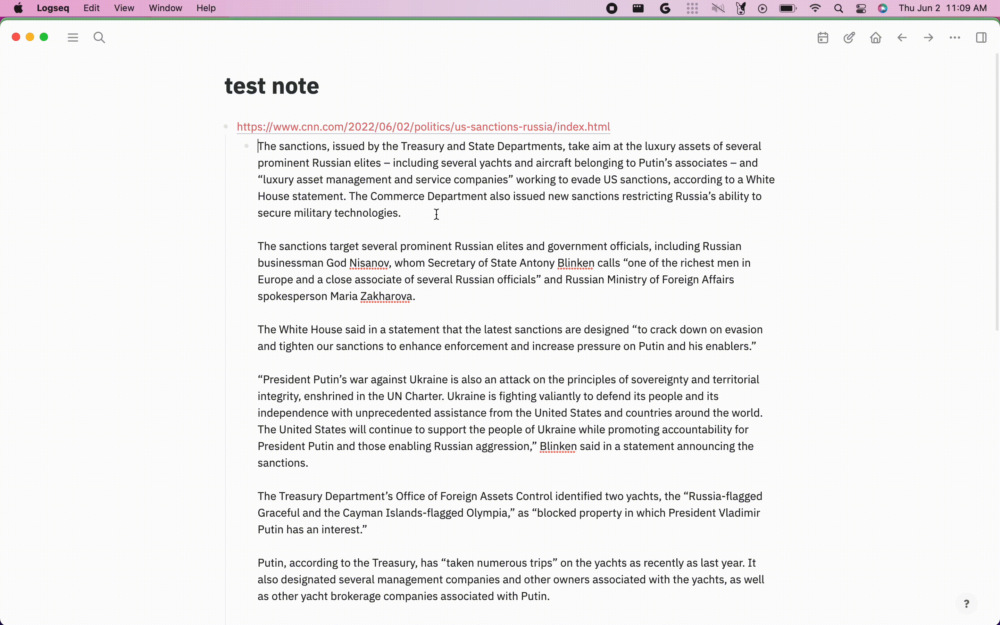

# Logseq Summarizer

Uses [sumy](https://pypi.org/project/sumy/) to summarize long text in logseq

## Alpha

Super WIP!!! May not work

## Installation

- Download a released version assets from Github.
- Unzip it.
- Click Load unpacked plugin, and select destination directory to the unzipped folder.

## Development

1. yarn
2. yarn workspace @summarizer/worker build
3. yarn workspace @summarizer/logseq build
4. Load the unpacked plugin

## Icon

[Data compression icons created by Eucalyp - Flaticon](https://www.flaticon.com/free-icons/data-compression)
